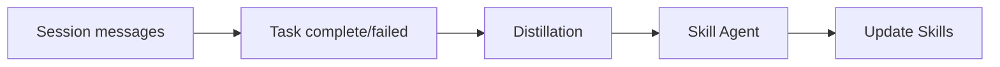
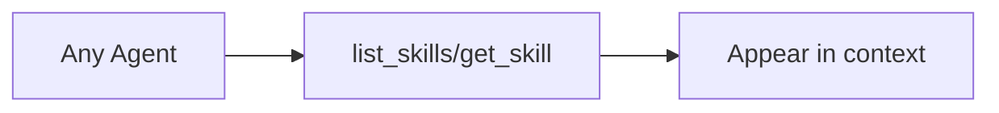
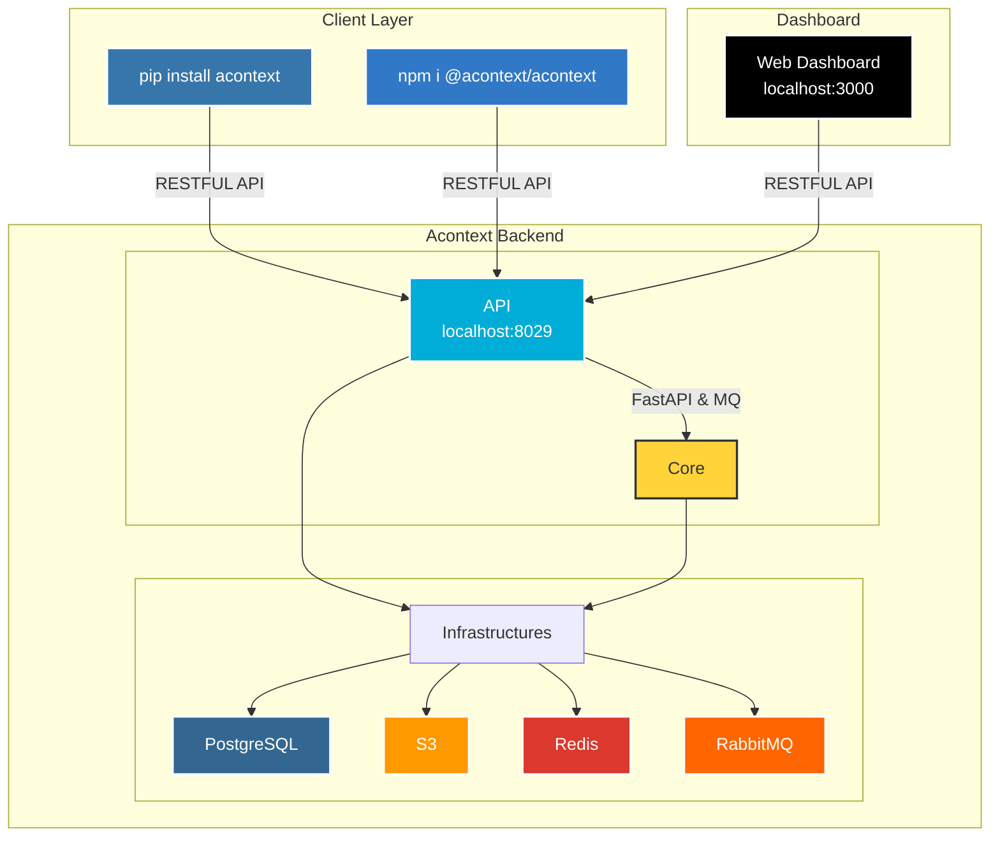

<div align="center">
  <a href="https://discord.acontext.io">
      
  </a>
 	<p align="center">
 	  	<a href="https://acontext.io">🌐 Website</a>
      |
 	  	<a href="https://docs.acontext.io">📚 Document</a>
  </p>
  <p align="center">
    <a href="https://pypi.org/project/acontext/"></a>
    <a href="https://www.npmjs.com/package/@acontext/acontext"></a>
    <a href="https://github.com/memodb-io/acontext/actions/workflows/core-test.yaml"></a>
    <a href="https://github.com/memodb-io/acontext/actions/workflows/api-test.yaml"></a>
    <a href="https://github.com/memodb-io/acontext/actions/workflows/cli-test.yaml"></a>
  </p>
<p align="center">
 	  	<a href="https://x.com/acontext_io"></a>
    <a href="https://discord.acontext.io"></a>
  </p>
</div>


## What is Acontext?

Acontext is an open-source Agent Skills as a Memory Layer: skill memory that **automatically** captures learnings from agent runs and stores knowledge as **Markdown files**. You can read, edit, and share those files across agents, LLMs and frameworks.

If you don't want the agent you build **repeat the same mistakes** or **fail to reuse what worked** — and you hate the opaque memory to pollute your context, give Acontext a try.

## Why?

People are building more and more complicated Agent Memory, making it **difficult to understand, debug and let the users to fix**. If agent skills can handle every knowledge agent needs with simple files, so as the memory. 

- Acontext try to build the memory upon agent skills format, so that everyone can actually understand what's the whole memory looks like. 
- Skill is Memory, Memory is Skill. No matter the skill is coming from the one your download from Clawhub, or the one you made up yourself, Acontext can follow the skills and evolve them accordingly.

## What Acontext Provides

- **Plain file, any framework** — Skill memories are Markdown files. Use them with LangGraph, Claude, AI SDK, or anything that reads files. No embeddings, no API lock-in. Git, grep, and mount to the sandbox.
- **You design the structure** — Attach more skills to the learning space, you can define how the schema, naming, and file layout of the memory. For example: one file per contact, per project for the user working context skill.
- **Progressive disclosure, not search** — The agent uses `get_skill` and `get_skill_file` to fetch what it needs. Retrieval is by tool use and reasoning, not semantic top-k. Full units (e.g. whole files), not chunked fragments.
- **Download as ZIP, reuse anywhere** — Export skill files as ZIP. Run locally, in another agent, or with another LLM. No vendor lock-in; no re-embedding or migration step.

## How It Works

### Store — How skills get written



- **Session messages** — Conversation (and optionally tool calls, artifacts) is the raw input. Tasks are extracted from the message stream automatically (or inferred from explicit outcome reporting).
- **Task complete or failed** — When a task is marked done or failed (e.g. by agent report or automatic detection), that outcome is the trigger for learning.
- **Distillation** — An LLM pass infers from the conversation and execution trace what worked, what failed, and user preferences.
- **Skill Agent** — Decides where to store (existing skill or new) and writes according to your `SKILL.md` schema.
- **Update Skills** — Skills are updated. You define the structure in `SKILL.md`; the system does extraction, routing, and writing.

### Recall — How the agent uses skills on the next run



Give your agent **Skill Content Tools** (`get_skill`, `get_skill_file`). The agent decides what it needs, calls the tools, and gets the skill content. No embedding search — **progressive disclosure, agent in the loop**.


# 🚀 Step-by-step Quickstart

### Connect to Acontext

1. Go to [Acontext.io](https://acontext.io), claim your free credits.
2. Go through a one-click onboarding to get your API Key (starts with `sk-ac`)

<div align="center">
    <picture>
      
    </picture>
</div>


<details>
<summary>💻 Self-host Acontext</summary>

We have an `acontext-cli` to help you do quick proof-of-concept. Download it first in your terminal:

```bash
curl -fsSL https://install.acontext.io | sh
```

You should have [docker](https://www.docker.com/get-started/) installed and an OpenAI API Key to start an Acontext backend on your computer:

```bash
mkdir acontext_server && cd acontext_server
acontext server up
```

> Make sure your LLM has the ability to [call tools](https://platform.openai.com/docs/guides/function-calling). By default, Acontext will use `gpt-4.1`.

`acontext server up` will create/use  `.env` and `config.yaml` for Acontext, and create a `db` folder to persist data.


Once it's done, you can access the following endpoints:

- Acontext API Base URL: http://localhost:8029/api/v1
- Acontext Dashboard: http://localhost:3000/

</details>


### Install SDKs

We're maintaining Python [](https://pypi.org/project/acontext/) and Typescript [](https://www.npmjs.com/package/@acontext/acontext) SDKs. The snippets below are using Python.

> Click the doc link to see TS SDK Quickstart.

```bash
pip install acontext
```


### Initialize Client

```python
import os
from acontext import AcontextClient

# For cloud:
client = AcontextClient(
    api_key=os.getenv("ACONTEXT_API_KEY"),
)

# For self-hosted:
client = AcontextClient(
    base_url="http://localhost:8029/api/v1",
    api_key="sk-ac-your-root-api-bearer-token",
)
```


### Skill Memory in Action

Create a learning space, attach a session, and let the agent learn — skills are written as Markdown files automatically.

```python
from acontext import AcontextClient

client = AcontextClient(api_key="sk-ac-...")

# Create a learning space and attach a session
space = client.learning_spaces.create()
session = client.sessions.create()
client.learning_spaces.learn(space.id, session_id=session.id)

# Run your agent, store messages — when tasks complete, learning runs automatically
client.sessions.store_message(session.id, blob={"role": "user", "content": "My name is Gus"})
client.sessions.store_message(session.id, blob={"role": "assistant", "content": "Hi Gus! How can I help you today?"})
# ... agent runs ...

# List learned skills (Markdown files)
client.learning_spaces.wait_for_learning(space.id, session_id=session.id)
skills = client.learning_spaces.list_skills(space.id)

# Download all skill files to a local directory
for skill in skills:
    client.skills.download(skill_id=skill.id, path=f"./skills/{skill.name}")
```

> `wait_for_learning` is a blocking helper for demo purposes. In production, task extraction and learning run in the background automatically — your agent never waits.

### More Features

- **[Context Engineering](https://docs.acontext.io/engineering/editing)** — Compress context with summaries and edit strategies
- **[Disk](https://docs.acontext.io/store/disk)** — Virtual, persistent filesystem for agents
- **[Sandbox](https://docs.acontext.io/store/sandbox)** — Isolated code execution with bash, Python, and [mountable skills](https://docs.acontext.io/tool/bash_tools#mounting-skills-in-sandbox)
- **[Agent Tools](https://docs.acontext.io/tool/whatis)** — Disk tools, sandbox tools, and skill tools for LLM function calling


# 🧐 Use Acontext to build Agent

Download end-to-end scripts with `acontext`:

**Python**

```bash
acontext create my-proj --template-path "python/openai-basic"
```

More examples on Python:

- `python/openai-agent-basic`: openai agent sdk template
- `python/openai-agent-artifacts`: agent can edit and download artifacts
- `python/claude-agent-sdk`: claude agent sdk with `ClaudeAgentStorage`
- `python/agno-basic`: agno framework template
- `python/smolagents-basic`: smolagents (huggingface) template
- `python/interactive-agent-skill`: interactive sandbox with mountable agent skills

**Typescript**

```bash
acontext create my-proj --template-path "typescript/openai-basic"
```

More examples on Typescript:
- `typescript/vercel-ai-basic`: agent in @vercel/ai-sdk
- `typescript/claude-agent-sdk`: claude agent sdk with `ClaudeAgentStorage`
- `typescript/interactive-agent-skill`: interactive sandbox with mountable agent skills


> [!NOTE]
>
> Check our example repo for more templates: [Acontext-Examples](https://github.com/memodb-io/Acontext-Examples).
>
> We're cooking more full-stack Agent Applications! [Tell us what you want!](https://discord.acontext.io)


# 🔍 Document

To learn more about skill memory and what Acontext can do, visit [our docs](https://docs.acontext.io/) or start with [What is Skill Memory?](https://docs.acontext.io/learn/quick)


# ❤️ Stay Updated

Star Acontext on Github to support and receive instant notifications 


# 🏗️ Architecture

<details>
<summary>click to open</summary>



</details>

# 🤝 Stay Together

Join the community for support and discussions:

-   [Discuss with Builders on Acontext Discord](https://discord.acontext.io) 👻 
-  [Follow Acontext on X](https://x.com/acontext_io) 𝕏 


# 🌟 Contributing

- Check our [roadmap.md](./ROADMAP.md) first.
- Read [contributing.md](./CONTRIBUTING.md)


# 🥇 Badges

 

```md
[](https://acontext.io)

[](https://acontext.io)
```


# 📑 LICENSE

This project is currently licensed under [Apache License 2.0](LICENSE).

